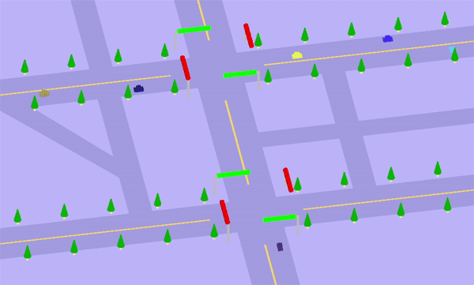

# multi_car_simultion

## Demo

- 데모 영상에서 사용자의 자동차는 가운데 도로에서 아래에서 위로 직진하는 짙은 남색 이다.


### Contents

- 자동차 시뮬레이션 및 자동차 운전 점수 측정
- 출발지 부터 도착지 (파란 큐브로 표시) 까지 주행 시뮬레이션
- 다른 자동차들과의 충돌 , 신호 위반 등을 측정하여 점수 계산
- ``A``, ``D`` , ``W``, ``S`` 키를 통해 회전, 직진 및 후진 조절
- ~~실제 뱅뱅 사거리 주변 도로 특징을 본따서 만들었지만, 티가 티끌도 안나네요..ㅎㅎ~~
- 사용 기술 : ``OpenGL``, ``C++``

## file tree

```bash
└─car_simulator
    ├─main.cpp
    ├─map.cpp
    ├─traffic_sign.cpp
    ├─user_car.cpp
    ├─car.cpp
    ├─basic_setting.cpp
    ├─map.h
    ├─traffic_sign.h
    ├─user_car.h
    ├─car.h
    └─basic_setting.h
```

## To Do
***

- [ ] 나무 오브젝트 생성
- [ ] 감점 요소 추가

